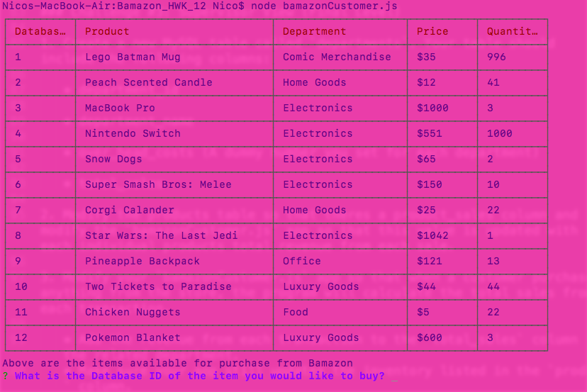
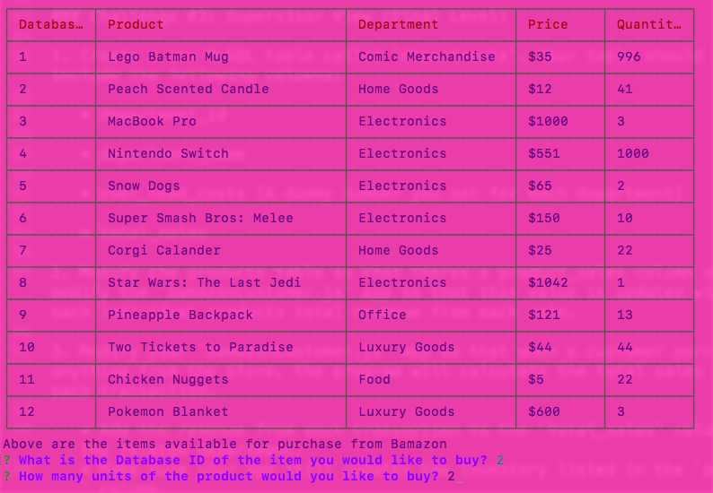
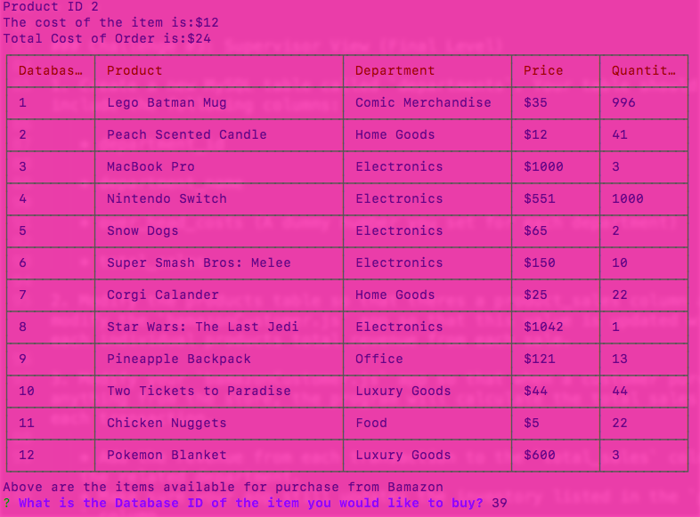
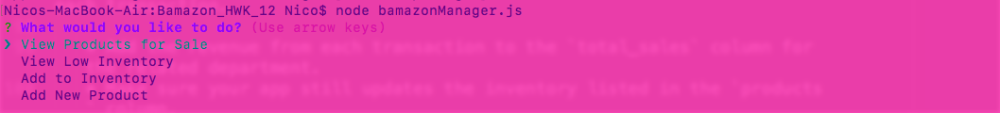
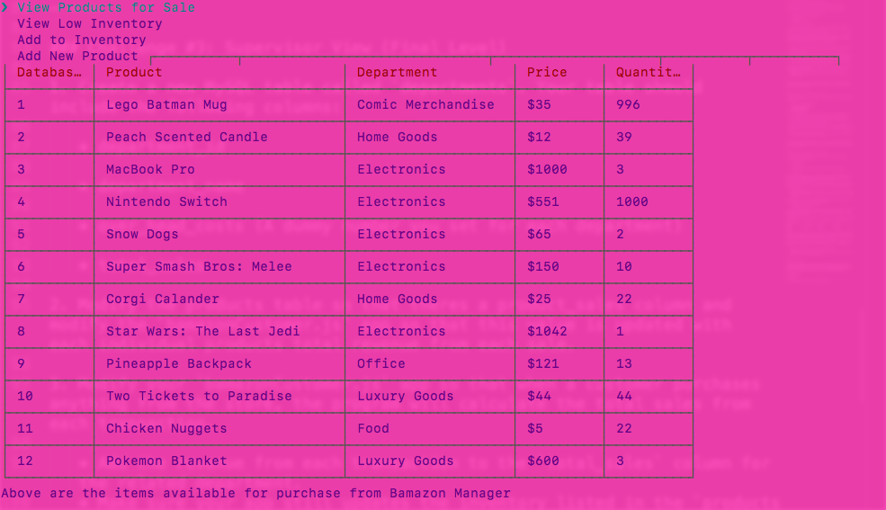
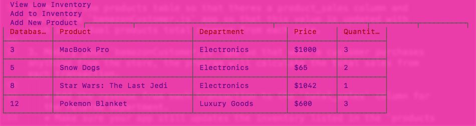
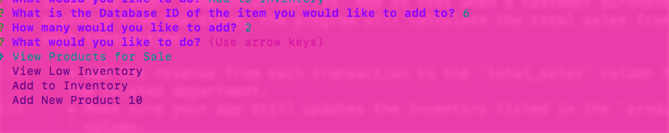
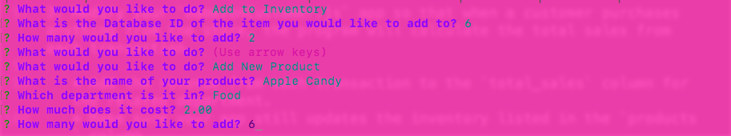
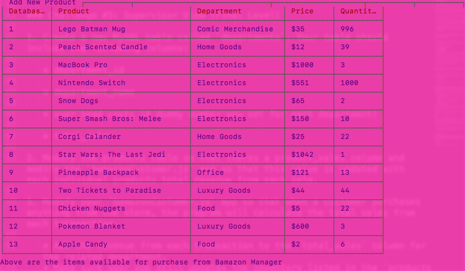

# Bamazon_HWK_12

# App Description:

Created a backend application using node.js, javascript, and mySQL that stores and can create items for shopers. 

Individuals can also purchase items using this application from the database. 

# Instructions:

* Open the bamazonCustomer.js terminal by typing "node bamazonCustomer.js" this will then display the database of items for sale. Then the user can choose what item they want to purchase by selecting item id. After that the user can select how many, and see if the item is in stock. If so they can purchase and see the total amount spent on the amount of items purchased. 

* Open the bamazonManager.js in terminal by typing "node bamazonManager.js". Then the "manager" can select if they want to 
 * View Products for Sale
    * View Low Inventory
    * Add to Inventory
    * Add New Product

# Technologies Used: 
	*  Node.js
	*  Javascript
	*  MySQL

## Code Working Examples: 

Since users cannot access MySQL database from GitHub examples of how the application works is presented below. 

;
;
;
;
;
;
;
;
;

